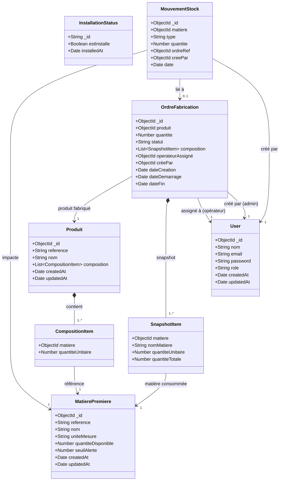

# Diagramme de Classes UML - FactoryFlow

```mermaid
classDiagram
    direction TB

    class User {
        +ObjectId _id
        +String nom
        +String email
        +String password
        +String role
        +Date createdAt
        +Date updatedAt
    }

    class InstallationStatus {
        +String _id
        +Boolean estInstalle
        +Date installedAt
    }

    class MatierePremiere {
        +ObjectId _id
        +String reference
        +String nom
        +String uniteMesure
        +Number quantiteDisponible
        +Number seuilAlerte
        +Date createdAt
        +Date updatedAt
    }

    class Produit {
        +ObjectId _id
        +String reference
        +String nom
        +List~CompositionItem~ composition
        +Date createdAt
        +Date updatedAt
    }

    class CompositionItem {
        +ObjectId matiere
        +Number quantiteUnitaire
    }

    class OrdreFabrication {
        +ObjectId _id
        +ObjectId produit
        +Number quantite
        +String statut
        +List~SnapshotItem~ composition
        +ObjectId operateurAssigné
        +ObjectId créePar
        +Date dateCreation
        +Date dateDemarrage
        +Date dateFin
    }

    class SnapshotItem {
        +ObjectId matiere
        +String nomMatiere
        +Number quantiteUnitaire
        +Number quantiteTotale
    }

    class MouvementStock {
        +ObjectId _id
        +ObjectId matiere
        +String type
        +Number quantite
        +ObjectId ordreRef
        +ObjectId creePar
        +Date date
    }

    %% Relations
    Produit *-- "1..*" CompositionItem : contient
    CompositionItem --> "1" MatierePremiere : référence

    OrdreFabrication --> "1" Produit : produit fabriqué
    OrdreFabrication *-- "1..*" SnapshotItem : snapshot
    SnapshotItem --> "1" MatierePremiere : matière consommée
    OrdreFabrication --> "1" User : assigné à (opérateur)
    OrdreFabrication --> "1" User : créé par (admin)

    MouvementStock --> "1" MatierePremiere : impacte
    MouvementStock --> "0..1" OrdreFabrication : lié à
    MouvementStock --> "1" User : créé par
```
